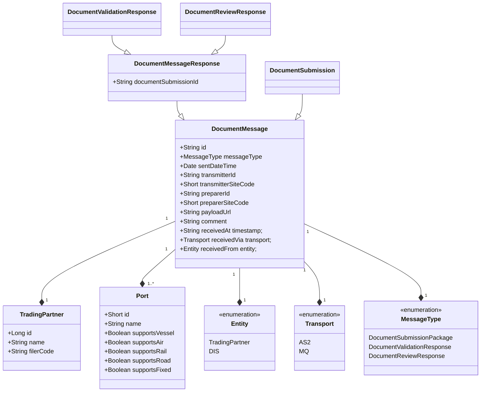

# Core - Domain Model

```mermaid
 classDiagram

    class TradingPartner {
        +Long id
        +String name
        +String filerCode        
    }

    class Port {
        +Short id
        +String name
        +Boolean supportsVessel
        +Boolean supportsAir
        +Boolean supportsRail
        +Boolean supportsRoad
        +Boolean supportsFixed
    }

    class Entity {
        <<enumeration>>
        TradingPartner
        DIS
    }

    class Transport {
        <<enumeration>>
        AS2
        MQ
    }

    class MessageType {
        <<enumeration>>
        DocumentSubmissionPackage
        DocumentValidationResponse
        DocumentReviewResponse
    }

    class DocumentMessage {
        +String id 
        +MessageType messageType
        +Date sentDateTime
        +String transmitterId
        +Short transmitterSiteCode
        +String preparerId
        +Short preparerSiteCode        
        +String payloadUrl
        +String comment
        +String receivedAt timestamp;
        +Transport receivedVia transport;
        +Entity receivedFrom entity;
    }

    class DocumentMessageResponse {
        +String documentSubmissionId
    }

    DocumentMessageResponse --|> DocumentMessage

    DocumentSubmission --|> DocumentMessage

    DocumentValidationResponse --|> DocumentMessageResponse
    DocumentReviewResponse --|> DocumentMessageResponse

    DocumentMessage "1" --* "1" TradingPartner
    DocumentMessage "1" --* "1..*" Port
    DocumentMessage "1" --* "1" Entity
    DocumentMessage "1" --* "1" Transport
    DocumentMessage "1" --* "1" MessageType
   
          

```
