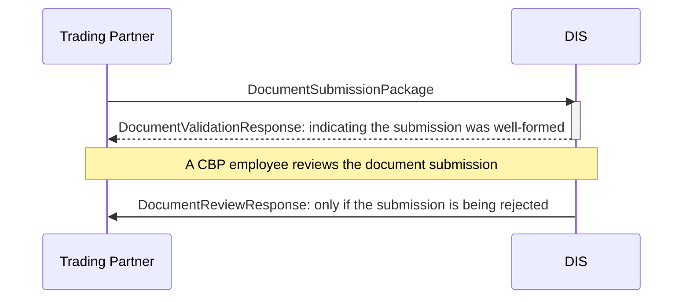

# DIS - Overview

There are three distinct messages types that are used when submitting documents to DIS:

- DocumentSubmissionPackage
- DocumentValidationResponse
- DocumentReviewResponse




Messages are encoded as XML, and document submissions can be made via one of three transports:

- MQ (**we will be using this one**)
- Secure FTP
- SOAP web service

Regardless of the transport used for submission, all responses from DIS will be sent via the MQ interface. 

## MQ

There are two sets of connection details for the DIS MQ, one for certification/testing and one for production:

| Interface         | IP                | Port | Queue Manager  |
|-------------------|-------------------|------|----------------|
| Certification     | 167.144.89.231    | 1531 | QGC1           |
| Production        | 167.144.89.228    | 1530 | QGP2           |

Document submissions should be published into the `ATS.DIS.MSG.INBOUND` queue with a **max message size of 100 MB**.

Validation and review responses will be received via the `ATS.DIS.<PORT_CODE>.<FILER_CODE>.Outbound` queue where:

- `<PORT_CODE>` is a four-digit port code
- `<FILER_CODE>` is a three-character filer code

## XML Format

> Note: a full specification of the XML format for submission to DIS can be found in the `domain/src/main/resources/xsd` 
folder.

All messages will be wrapped in a `MessageEnvelope` and contain a `MessageHeader` and `MessageBody`:

```xml
<DIS:MessageEnvelope xmlns:DIS="http://cbp.dhs.gov/DIS"
xmlns:xsd="http://www.w3.org/2001/XMLSchema"
xmlns:xsi="http://www.w3.org/2001/XMLSchema-instance">
    <DIS:MessageHeader>
        ...
    </DIS:MessageHeader>
    <DIS:MessageBody>
        ...
    </DIS:MessageBody>
</DIS:MessageEnvelope>
``` 

### Message Header

All the information that is required to determine how to forward messages between Trading Partners and DIS is contained 
within the `MessageHeader`.

```xml
<DIS:MessageHeader>
    <DIS:MessageID>1005997</DIS:MessageID>
    <DIS:MessageType>DocumentSubmission</DIS:MessageType>
    <DIS:SentDateTime>2010-07-28T09 :30 :47-05 :00</DIS:SentDateTime>
    <DIS:TransmitterID>ABC</DIS:TransmitterID>
    <DIS:TransmitterSiteCode>3001</DIS:TransmitterSiteCode>
    <DIS:PreparerID>ABC</DIS:PreparerID>
    <DIS:PreparerSiteCode>3001</DIS:PreparerSiteCode>
</DIS:MessageHeader>
```

### Message Body

We are only interested in the `MessageBody` when processing responses to a document submission. 

In such cases,
the `MessageBody` will contain a `ProcessedMessageHeader` entry corresponding to the `MessageHeader` provided in the 
document submission to which the response relates. 


