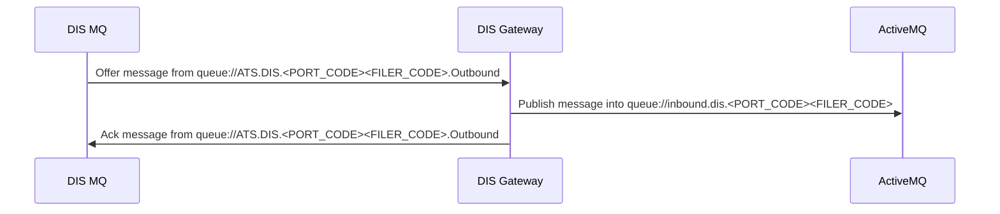

# DIS - Document Review

```mermaid
sequenceDiagram
    DIS MQ ->> DIS Gateway: Offer message from queue://ATS.DIS.<PORT_CODE><FILER_CODE>.Outbound
    DIS Gateway ->> ActiveMQ: Publish message into queue://inbound.dis.<PORT_CODE><FILER_CODE>
    DIS Gateway ->> DIS MQ: Ack message from queue://ATS.DIS.<PORT_CODE><FILER_CODE>.Outbound                        
```
