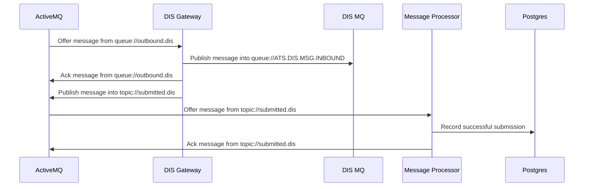

# DIS - Document Submission

```mermaid
sequenceDiagram
    ActiveMQ ->> DIS Gateway: Offer message from queue://outbound.dis
    DIS Gateway ->> DIS MQ: Publish message into queue://ATS.DIS.MSG.INBOUND
    DIS Gateway ->> ActiveMQ: Ack message from queue://outbound.dis
    DIS Gateway ->> ActiveMQ: Publish message into topic://submitted.dis
    ActiveMQ ->> Message Processor: Offer message from topic://submitted.dis
    Message Processor ->> Postgres: Record successful submission    
    Message Processor ->> ActiveMQ: Ack message from topic://submitted.dis        
```
