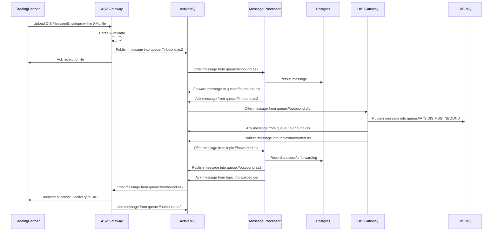

# AS2

## Basic Message Flow

```mermaid
sequenceDiagram
    TradingPartner ->> AS2 Gateway: Upload DIS MessageEnvelope within XML file
    AS2 Gateway ->> AS2 Gateway: Parse & validate
    AS2 Gateway ->> ActiveMQ: Publish message into queue://inbound.as2    
    AS2 Gateway ->> TradingPartner: Ack receipt of file
    ActiveMQ ->> Message Processor: Offer message from queue://inbound.as2
    Message Processor ->> Postgres: Persist message
    Message Processor ->> ActiveMQ: Forward message to queue://outbound.dis
    Message Processor ->> ActiveMQ: Ack message from queue://inbound.as2
    ActiveMQ ->> DIS Gateway: Offer message from queue://outbound.dis
    DIS Gateway ->> DIS MQ: Publish message into queue://ATS.DIS.MSG.INBOUND
    DIS Gateway ->> ActiveMQ: Ack message from queue://outbound.dis
    DIS Gateway ->> ActiveMQ: Publish message into topic://forwarded.dis
    ActiveMQ ->> Message Processor: Offer message from topic://forwarded.dis
    Message Processor ->> Postgres: Record successful forwarding
    Message Processor ->> ActiveMQ: Publish message into queue://outbound.as2
    Message Processor ->> ActiveMQ: Ack message from topic://forwarded.dis   
    ActiveMQ ->> AS2 Gateway: Offer message from queue://outbound.as2
    AS2 Gateway ->> TradingPartner: Indicate successful delivery to DIS
    AS2 Gateway ->> ActiveMQ: Ack message from queue://outbount.as2
```

