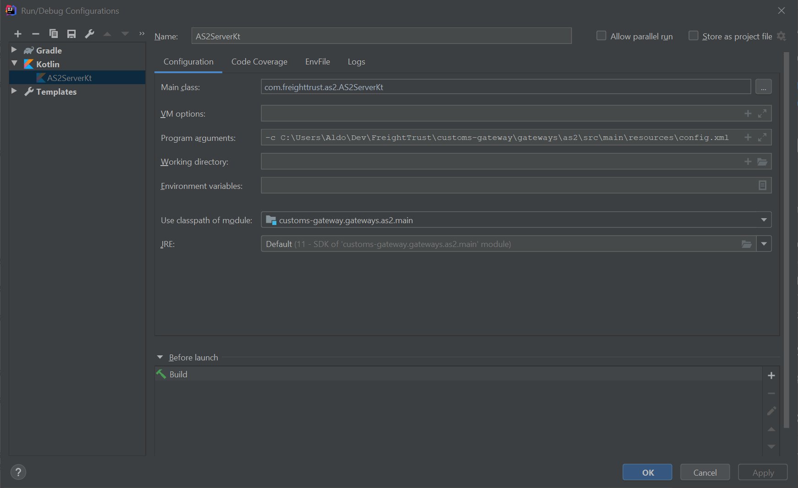

# AS2 Gateway

The AS2 Gateway is responsible for communications to and from Trading Partners via the AS2 protocol.

## Basic Workflow

**Note:**

- `<MESSAGE_TYPE>` represents the message body payload type e.g. `DocumentSubmissionPackage` or `MessageValidationResponse`.
- `<PORT_CODE>` represents the 4 digit transmitter port code in the message header.
- `<FILER_CODE>` represents the 3 character transmitter filer code in the message header. 


### Inbound from AS2

TBD

### Outbound to DIS

TBD

## AS2-lib

We are using [AS2-lib](https://github.com/phax/as2-lib/) as starting library for handling AS2 interactions.
You can have a look at this [reference documentation of OpenAS2 (original source on which `AS2-lib` is based)](http://openas2.sourceforge.net/).

### Running AS2-lib

Configure IntelliJ as follows (adapt accordingly the path pointing to `config.xml` file):



Make sure you have downloaded Socket client to test properly:

- Windows: [Download this client](https://sourceforge.net/projects/sockettest/)
- Linux: [Use netcat as described here](https://unix.stackexchange.com/a/336919)

By default, if you have used our provided `config.xml` that can be found inside `gateways/as2/src/main/resources` a 
`SocketCommandProcessor` is enabled and ready to receive commands.

## AS2-lib generic configuration overview

There are three important files we need to tweak and configure in order to have a successfully running instance of `AS2-lib`. Those are:

- `config.xml`: Configures the application such as the types of modules that are started, the logging systems, command processors and global properties.
- `partnerships.xml`: Configures the partners and partnerships. Provides the ability to specify different signing and encryption algorithms, message compression, MDN handling, etc.
- `commands.xml`: The application provides a way to enter commands to control and configure the system whilst it is running either via the console, or a remote tool (configured in the `config.xml` file above). This file stores the commands that the application will support. This file should not be modified.
- `certs.p12`: A PKCS12 keystore that stores the SSL certificates used to secure the messages for all partners. It contains the primary key for your own company as well as the public keys for all your trading partners.

> Note: A restart of the application is required to load any configuration changes!

### AS2-lib application configuration (`config.xml`)

The general structure of the `config.xml` file is the following (the comments explains each section accordingly):

```xml
<?xml version="1.0" encoding="utf-8"?>
<openas2>

    <!-- ServerXMLPartnershipFactory is the class in charge of reading / parsing the partnerships.xml file -->
    <!-- The class will monitor the file to see if there are changes and updates. -->
    <partnerships classname="com.helger.as2.app.partner.ServerXMLPartnershipFactory"
        filename="%home%/partnerships.xml"/>

    <!-- ServerCertificateFactory is the class in charge of reading / parsing the certs.p12 file -->
    <!-- The class will monitor the file to see if there are changes and updates. -->
    <certificates classname="com.helger.as2.app.cert.ServerCertificateFactory" 
        type="pkcs12"
        filename="%home%/certs.p12"
        password="test"
        interval="300"/>

    <!-- XMLCommandRegistry is the class in charge of reading / parsing the commands.xml file -->
    <commands classname="com.helger.as2.cmd.XMLCommandRegistry"
        filename="%home%/commands.xml"/>

    <!-- 
        Here is the list of command processors that listens for special commands to manage the server. 
        In this case the server will read and process commands by using the SocketCommandProcessor and the StreamCommandProcessor.
        Every change as an admin we perform with a command here, will be saved correspondely to above configurations, i.e:
        if we add a new partner via the SocketCommandProcessor, it will be persisted inside the partnerships.xml file.

        This allows us to configure AS2 dynamically. The list of commands are the following:

        For certs:
            - ClearCertsCommand
            - DeleteCertCommand
            - ImportCertCommand
            - ImportCertInEncodedStreamCommand
            - ListCertCommand
            - ViewCertCommand

        For partners:
            - AddPartnerCommand
            - AddPartnershipCommand
            - DeletePartnerCommand
            - DeletePartnershipCommand
            - ListPartnersCommand
            - ListsPartnershipsCommand
            - RefreshPartnershipsCommand
            - StorePartnershipsCommand
            - ViewPartnerCommand
            - ViewPartnershipCommand
    -->
    <commandProcessors>
        <commandProcessor classname="com.helger.as2.cmdprocessor.StreamCommandProcessor"/>
        <commandProcessor classname="com.helger.as2.cmdprocessor.SocketCommandProcessor"  
            portId="4321" userid="userid" password="pwd"/>
  </commandProcessors>

  <!-- 
      List of modules in charge of processing each incoming message.
      The list is order dependent.

      DefaultMessageProcessor will run each module in a for loop and apply and ask to 
      each one if the message applies to them if the rules defined matches or not.
  -->
  <processor classname="com.helger.as2lib.processor.DefaultMessageProcessor"
             pendingMDN="data/pendingMDN3"
             pendingMDNinfo="data/pendinginfoMDN3">

    <module classname="com.helger.as2lib.processor.sender.AS2SenderModule" />

    <!-- ... Other modules -->
  </processor>
 
</openas2>
```

### AS2-lib commands configuration (`commands.xml`)

This file lists the all the possible commands available to manage the server within the `SocketCommandProcessor`.

```xml
<commands>
  <multicommand name="cert" description="Certificate commands">
    <command classname="com.helger.as2.cmd.cert.ImportCertCommand" />
    <command classname="com.helger.as2.cmd.cert.ImportCertInEncodedStreamCommand" />
    <command classname="com.helger.as2.cmd.cert.ListCertCommand" />
    <command classname="com.helger.as2.cmd.cert.DeleteCertCommand" />
    <command classname="com.helger.as2.cmd.cert.ClearCertsCommand" />
    <command classname="com.helger.as2.cmd.cert.ViewCertCommand" />
  </multicommand>
  <multicommand name="partner" description="Partner commands">
    <command classname="com.helger.as2.cmd.partner.ListPartnersCommand" />
    <command classname="com.helger.as2.cmd.partner.AddPartnerCommand" />
    <command classname="com.helger.as2.cmd.partner.DeletePartnerCommand" />
    <command classname="com.helger.as2.cmd.partner.ViewPartnerCommand" />
  </multicommand>
  <multicommand name="partnership" description="Partnership commands">
    <command classname="com.helger.as2.cmd.partner.RefreshPartnershipsCommand" />
    <command classname="com.helger.as2.cmd.partner.ListPartnershipsCommand" />
    <command classname="com.helger.as2.cmd.partner.AddPartnershipCommand" />
    <command classname="com.helger.as2.cmd.partner.DeletePartnershipCommand" />
    <command classname="com.helger.as2.cmd.partner.StorePartnershipsCommand" />
    <command classname="com.helger.as2.cmd.partner.ViewPartnershipCommand" />
  </multicommand>
</commands>
```

### AS2-lib partnerships configuration (`partnerships.xml`)

The configuration is stored into `partnerships.xml` and the generic format is the following:

```xml
<partnerships>
    <!-- Definition of partners -->
	<partner name="OpenAS2A" as2_id="OpenAS2A" x509_alias="OpenAS2A_alias" email="OpenAS2 A email"/>
	<partner name="OpenAS2B" as2_id="OpenAS2B" x509_alias="OpenAS2B_alias" email="OpenAS2 B email"/>	

    <!-- Definition of partnerships -->
	<partnership name="OpenAS2A-OpenAS2B">
		<sender name="OpenAS2A"/>
		<receiver name="OpenAS2B"/>
		<attribute name="protocol" value="as2"/>
		<attribute name="subject" value="From OpenAS2A to OpenAS2B"/>
		<attribute name="as2_url" value="http://localhost:10080"/>
		<attribute name="as2_mdn_to" value="http://localhost:10080"/>
		<attribute name="as2_mdn_options" value="signed-receipt-protocol=optional, pkcs7-signature; signed-receipt-micalg=optional, md5"/>
		<attribute name="encrypt" value="3des"/>
		<attribute name="sign" value="md5"/>
	</partnership>
	
	<partnership name="OpenAS2B-OpenAS2A">
		<sender name="OpenAS2B"/>
		<receiver name="OpenAS2A"/>
		<attribute name="protocol" value="as2"/>
		<attribute name="subject" value="From OpenAS2B to OpenAS2A"/>
		<attribute name="as2_url" value="http://localhost:10080"/>
		<attribute name="as2_mdn_to" value="http://localhost:10080"/>
		<attribute name="as2_mdn_options" value="signed-receipt-protocol=optional, pkcs7-signature; signed-receipt-micalg=optional, sha1"/>
		<attribute name="encrypt" value="3des"/>
		<attribute name="sign" value="sha1"/>
	</partnership>
</partnerships>
```

We can update dynamically the configuration with the following messages to the socket server (replace `userid` and `password` with appropriate values, default values are used):

**Add partner**:

```xml
<command userid="user" password="pwd">partner add name <attribute 1=value 1> <attribute 2=value 2> ... <attribute n=value n></command>
```

**Add partnership**:

```xml
<command userid="user" password="pwd">partner add name senderId receiverId <attribute 1=value 1> <attribute 2=value 2> ...</command>
```

**Delete partner**:

```xml
<command userid="user" password="pwd">partner delete <name></command>
```

**Delete partnership**:

```xml
<command userid="user" password="pwd">partner delete <name></command>
```

**List partners**:

```xml
<command userid="user" password="pwd">partner list</command>
```

**List partnerships**:

```xml
<command userid="user" password="pwd">partnership list</command>
```

**Refresh partnerships**:

```xml
<command userid="user" password="pwd">partnership refresh</command>
```

**Store partnerships**:

```xml
<command userid="user" password="pwd">partnership store</command>
```

**View partner**:

```xml
<command userid="user" password="pwd">partnership view <name></command>
```

**View partnership**:

```xml
<command userid="user" password="pwd">partnership view <name></command>
```

## AS2-lib certificates configuration (`certs.p12`)

The certificates are loaded from the `.p12` file specified in `config.xml`. But also we can send the following commands to the socket server:

**Clear certificate**:

```xml
<command userid="user" password="pwd">cert clear</command>
```

**Delete certificate**:

```xml
<command userid="user" password="pwd">cert delete <alias></command>
```

**Import certificate**:

```xml
<command userid="user" password="pwd">cert import <alias> <filename> [<password>]</command>
```

**Import certificate encoded**:

```xml
<command userid="user" password="pwd">cert importbybstream <alias> <encodedCertificateStream></command>
```

**List certificate**:

```xml
<command userid="user" password="pwd">cert list</command>
```

**View certificate**:

```xml
<command userid="user" password="pwd">cert view <alias></command>
```
