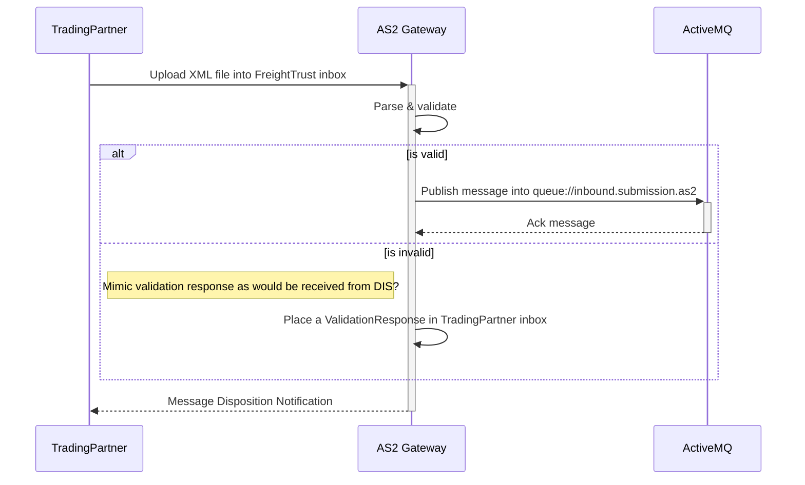
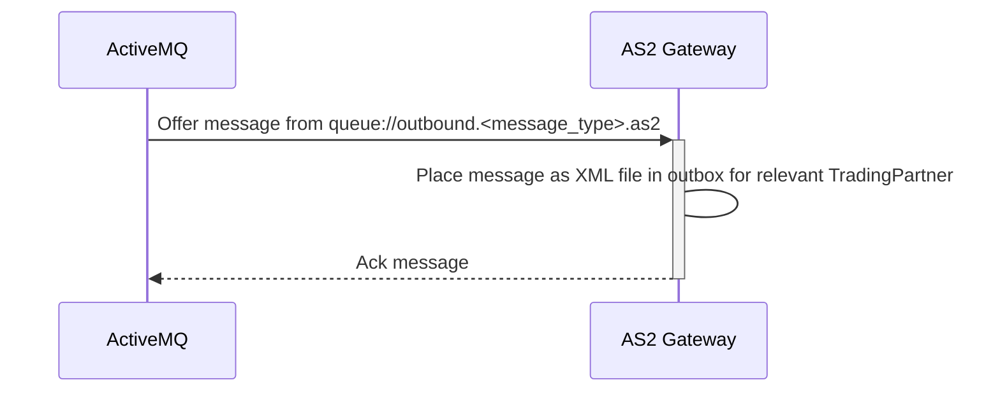

# AS2 Gateway

## Document Submission

```mermaid
sequenceDiagram
    TradingPartner ->>+ AS2 Gateway: Upload XML file into FreightTrust inbox        
    AS2 Gateway ->> AS2 Gateway: Parse & validate
    alt is valid
        AS2 Gateway ->>+ ActiveMQ: Publish message into queue://inbound.submission.as2
        ActiveMQ -->>- AS2 Gateway: Ack message      
    else is invalid
        Note left of AS2 Gateway: Mimic validation response as would be received from DIS?
        AS2 Gateway ->> AS2 Gateway: Place a ValidationResponse in TradingPartner inbox
    end                 
    AS2 Gateway -->>- TradingPartner: Message Disposition Notification    
```

## Document Validation & Review

```mermaid
sequenceDiagram
    ActiveMQ ->>+ AS2 Gateway: Offer message from queue://outbound.<message_type>.as2
    AS2 Gateway -> AS2 Gateway: Place message as XML file in outbox for relevant TradingPartner
    AS2 Gateway -->>- ActiveMQ: Ack message                         
```

