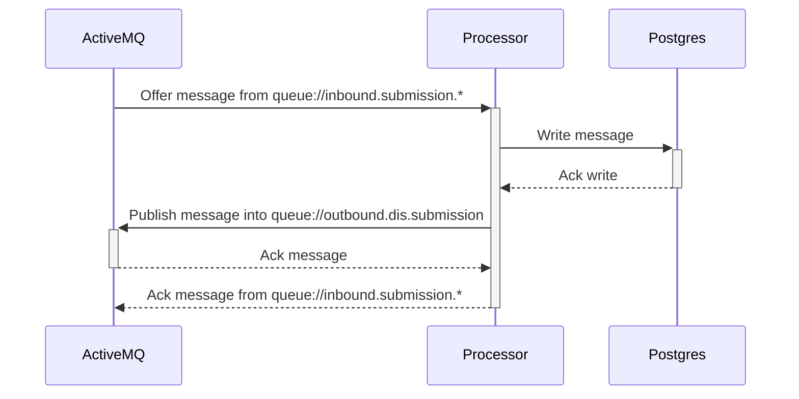
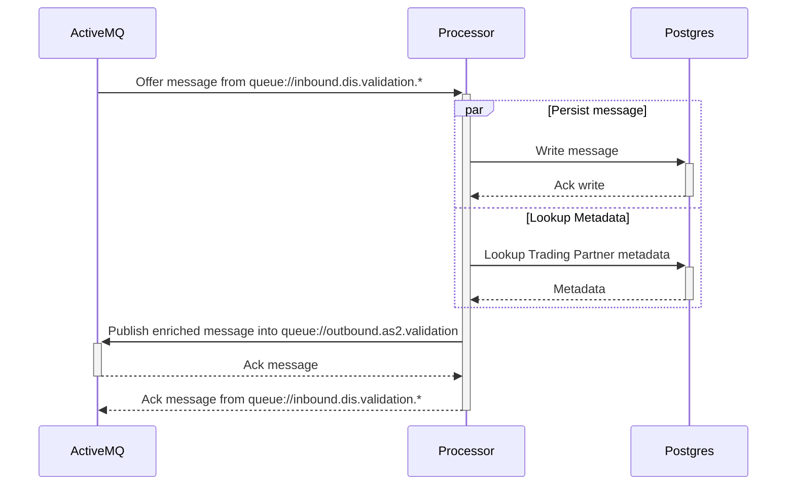
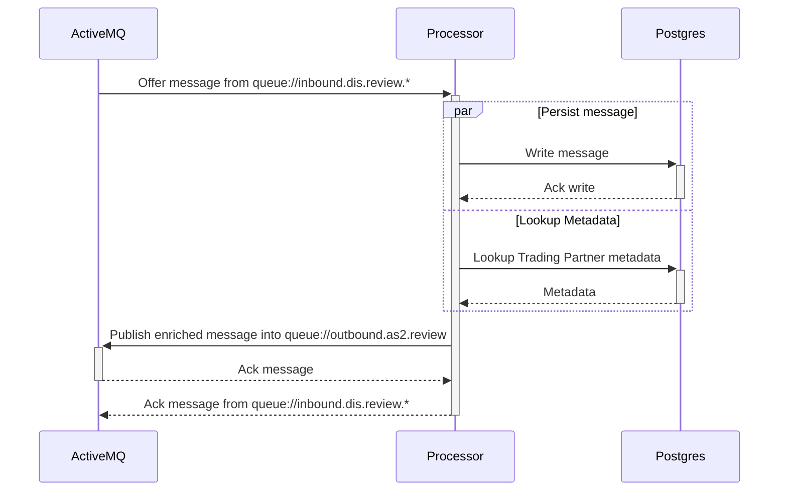

# Core Workflow

## Document Submission

```mermaid
sequenceDiagram
    ActiveMQ ->>+ Processor: Offer message from queue://inbound.submission.*
    Processor ->>+ Postgres: Write message
    Postgres -->>- Processor: Ack write
    Processor ->>+ ActiveMQ: Publish message into queue://outbound.dis.submission
    ActiveMQ -->>- Processor: Ack message
    Processor -->>- ActiveMQ: Ack message from queue://inbound.submission.*                             
```

## Document Validation 

```mermaid
sequenceDiagram    
    ActiveMQ ->>+ Processor: Offer message from queue://inbound.dis.validation.*
    par Persist message
        Processor ->>+ Postgres: Write message
        Postgres -->>- Processor: Ack write
    and Lookup Metadata
        Processor ->>+ Postgres: Lookup Trading Partner metadata
        Postgres -->>- Processor: Metadata
    end
    Processor ->>+ ActiveMQ: Publish enriched message into queue://outbound.as2.validation
    ActiveMQ -->>- Processor: Ack message
    Processor -->>- ActiveMQ: Ack message from queue://inbound.dis.validation.*                                             
```

## Document Review

```mermaid
sequenceDiagram    
    ActiveMQ ->>+ Processor: Offer message from queue://inbound.dis.review.*
    par Persist message
        Processor ->>+ Postgres: Write message
        Postgres -->>- Processor: Ack write
    and Lookup Metadata
        Processor ->>+ Postgres: Lookup Trading Partner metadata
        Postgres -->>- Processor: Metadata
    end
    Processor ->>+ ActiveMQ: Publish enriched message into queue://outbound.as2.review
    ActiveMQ -->>- Processor: Ack message
    Processor -->>- ActiveMQ: Ack message from queue://inbound.dis.review.*                                             
```

