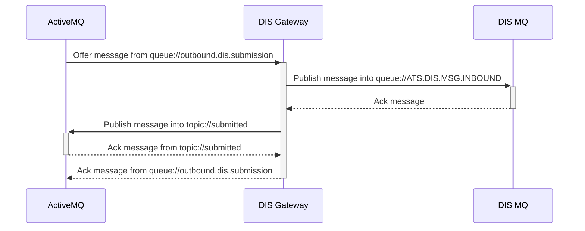
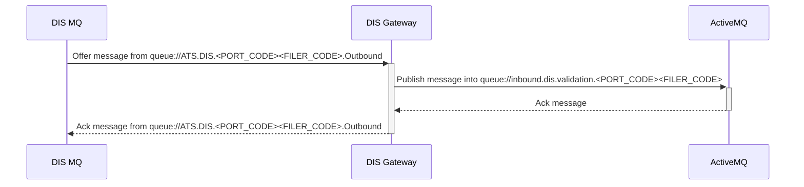
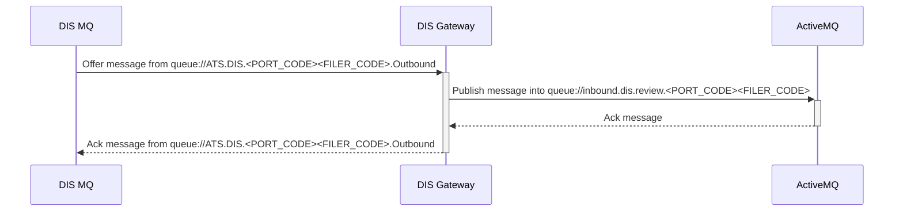

# DIS Gateway

## Document Submission

```mermaid
sequenceDiagram
    ActiveMQ ->>+ DIS Gateway: Offer message from queue://outbound.dis.submission
    DIS Gateway ->>+ DIS MQ: Publish message into queue://ATS.DIS.MSG.INBOUND
    DIS MQ -->>- DIS Gateway: Ack message    
    DIS Gateway ->>+ ActiveMQ: Publish message into topic://submitted
    ActiveMQ -->>- DIS Gateway: Ack message from topic://submitted
    DIS Gateway -->>- ActiveMQ: Ack message from queue://outbound.dis.submission                        
```

## Document Validation & Review

```mermaid
sequenceDiagram
    DIS MQ ->>+ DIS Gateway: Offer message from queue://ATS.DIS.<PORT_CODE><FILER_CODE>.Outbound    
    DIS Gateway ->>+ ActiveMQ: Publish message into queue://inbound.dis.validation.<PORT_CODE><FILER_CODE>
    ActiveMQ -->>- DIS Gateway: Ack message   
    DIS Gateway -->> DIS MQ: Ack message from queue://ATS.DIS.<PORT_CODE><FILER_CODE>.Outbound    
    deactivate DIS Gateway        
```

## Document Review

```mermaid
sequenceDiagram
    DIS MQ ->>+ DIS Gateway: Offer message from queue://ATS.DIS.<PORT_CODE><FILER_CODE>.Outbound    
    DIS Gateway ->>+ ActiveMQ: Publish message into queue://inbound.dis.review.<PORT_CODE><FILER_CODE>
    ActiveMQ -->>- DIS Gateway: Ack message
    DIS Gateway -->> DIS MQ: Ack message from queue://ATS.DIS.<PORT_CODE><FILER_CODE>.Outbound    
    deactivate DIS Gateway        
```

