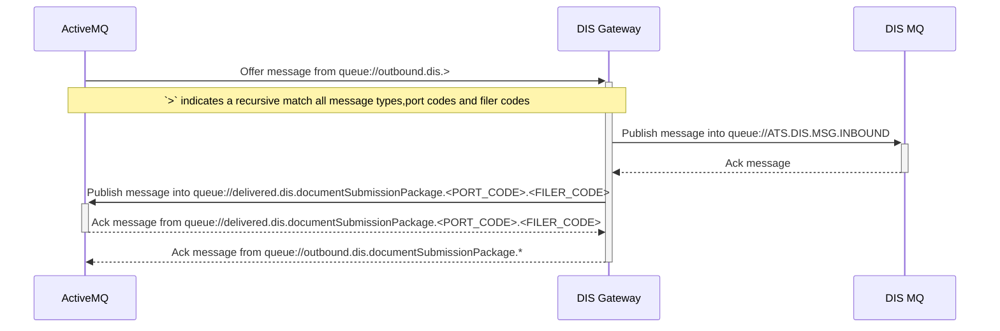
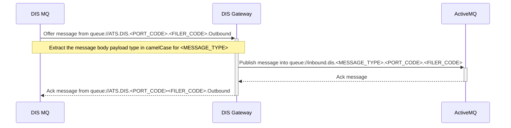

# DIS Gateway

The DIS Gateway is responsible for all communication to and from the DIS service via MQ.

## Basic Workflow

**Note:**

- `<MESSAGE_TYPE>` represents the message body payload type e.g. `DocumentSubmissionPackage` or `MessageValidationResponse`.
- `<PORT_CODE>` represents the 4 digit transmitter port code in the message header.
- `<FILER_CODE>` represents the 3 character transmitter filer code in the message header. 

### Outbound to DIS

### Inbound from DIS

