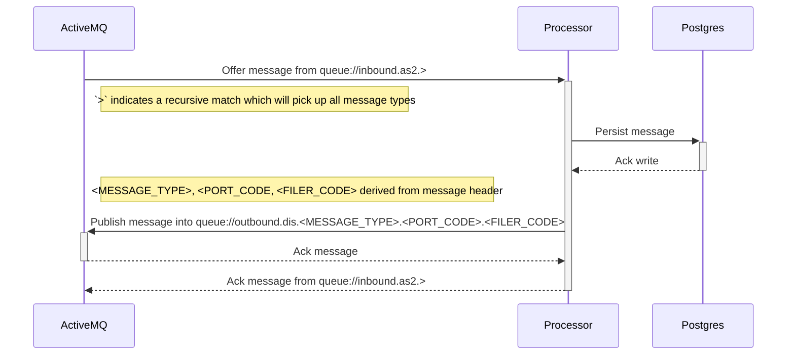
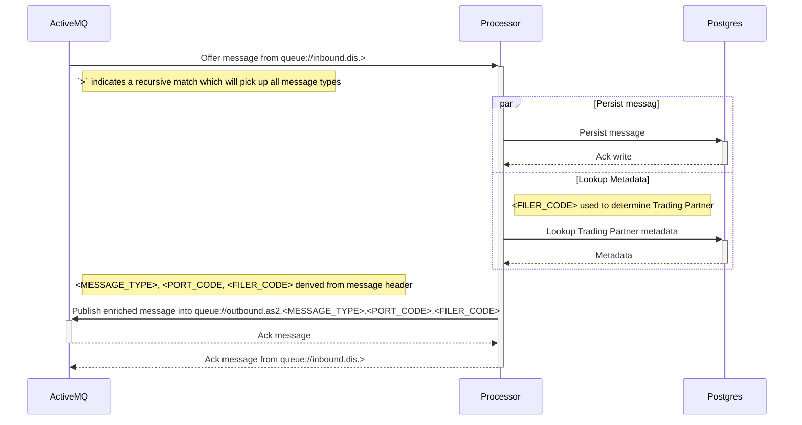

# Core Processing

This section describes the core message forwarding within the system. 

> For now we only support very basic message routing, with all messages originating from the `as2` gateway to be 
> forwarded to the `dis` gateway, and all messages received from the `dis` gateway to be forwarded to the relevant Trading 
> Partner in the `as2` gateway.

## Workflow 

**Note:**

- `<MESSAGE_TYPE>` represents the message body payload type e.g. `DocumentSubmissionPackage` or `MessageValidationResponse`.
- `<PORT_CODE>` represents the 4 digit transmitter port code in the message header.
- `<FILER_CODE>` represents the 3 character transmitter filer code in the message header. 

### AS2 to DIS

### DIS to AS2 

